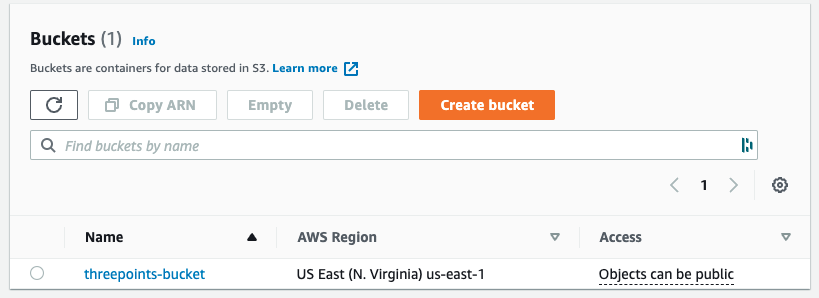
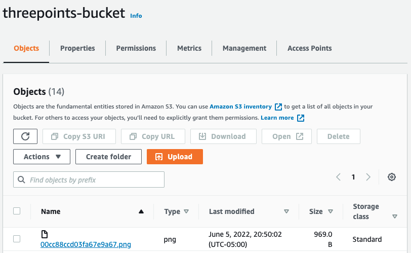
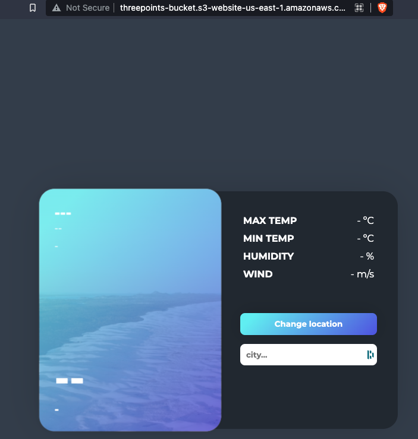

# Website Hosting AWS S3

### 📦 Unboxing project

This project was developed using terraform as Infrastructure as Code (IaC).

> Note. For starting to use this project, you need to install terraform.

#### 🚀 Launching project

```bash
terraform init
terraform apply
```

> Note. If you want to see the planning of this project, execute `terraform plan`.

From the output, you will see the following responses:
```bash
bucket = "s3://threepoints-bucket"
website_url = "threepoints-bucket.s3-website-us-east-1.amazonaws.com"
```

#### 📚 Documentation

After the project is built, you can see the response from console aws.

<div style="text-align:center">
    
    
</div>


Alse, you can see the aplication in the browser.

<div style="text-align:center">
    
</div>